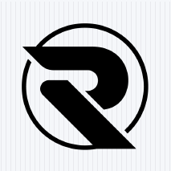
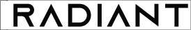
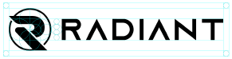
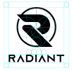
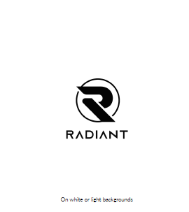
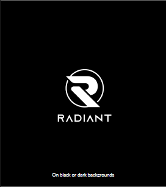
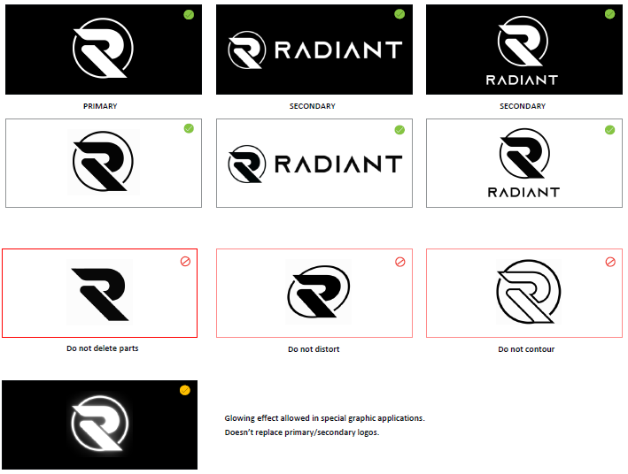
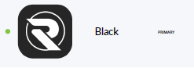
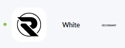
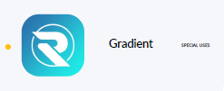

# Radiant (RXD) Logo Usage Guidelines

Version: 1.0 (Beta)  
Date: 2024

## Overview

This document provides guidelines for the correct usage of the Radiant (RXD) logo, including the symbol, wordmark, and combined versions. Adherence to these guidelines ensures consistency across all platforms and maintains the integrity of the Radiant brand.

## Logo Components

The Radiant logo consists of the following elements:

- **Symbol**:  
  

- **Wordmark**:  
  Typeface: AZONIX  
  Tracking spacing: 100  
  

- **Symbol + Wordmark (Logo)**:  
  Available in two layouts:  
  - **Wide**:  
      
  - **Stacked**:  
    

## Color Usage

There are two primary color modes for the logo:

1. **Primary Color**:  
   Use this version on white or light backgrounds.  
   Color code:  
   - RGB: (R0, G242, B242)

2. **Secondary Color**:  
   Use this version on black or dark backgrounds.  
   Color code:  
   - RGB: (R4, G4, B5)  
   - White: (R255, G255, B255)

**Examples**:  
- Primary on white background:  
    
- Secondary on dark background:  
  

## Logo Usage Rules

- **Do not delete any parts** of the logo.  
- **Do not distort or stretch** the logo in any way.  
- **Do not contour** the logo.  
- A glowing effect is allowed in special graphic applications but does **not replace** the primary or secondary logos.

## Icon Variants

The Radiant logo is available in the following icon variants:

- **Black**  
  

- **White**  
  

- **Gradient**  
  

## Special Use Cases

For special graphic applications, glowing effects can be applied while keeping the integrity of the original logo design.

## Additional Information

Visit the official Radiant websites for more information:

- [radiantblockchain.xyz](https://radiantblockchain.xyz/)
- [radiantblockchain.org](https://radiantblockchain.org/)

Join the Radiant community on [Discord](https://discord.gg/radiantblockchain).

Logo Guidelines by RGP.
